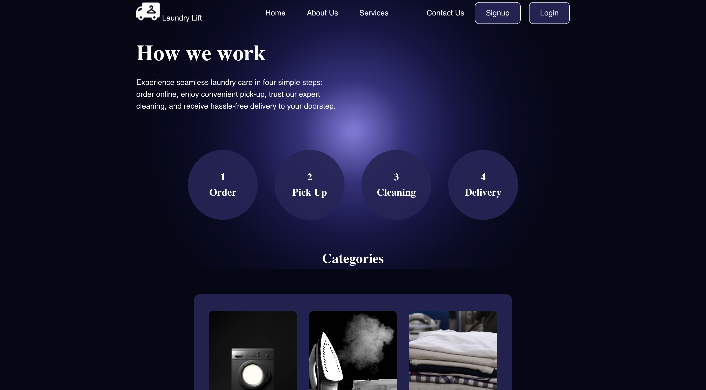
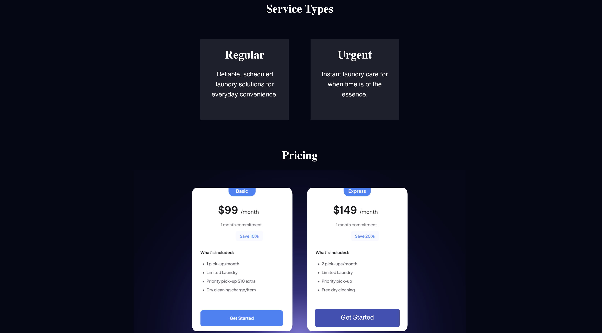
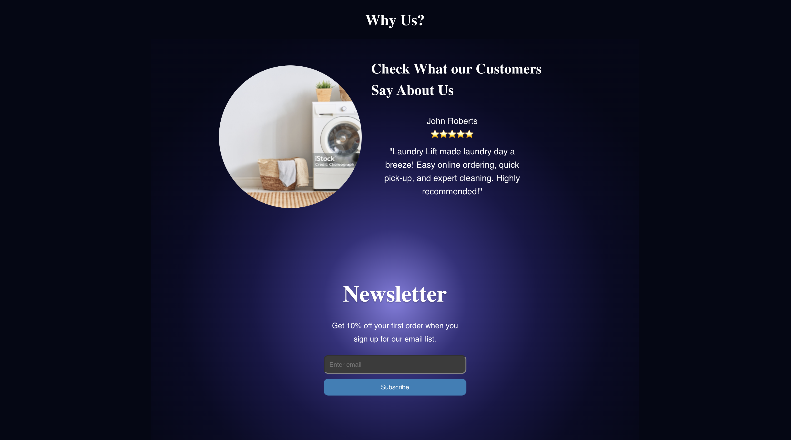
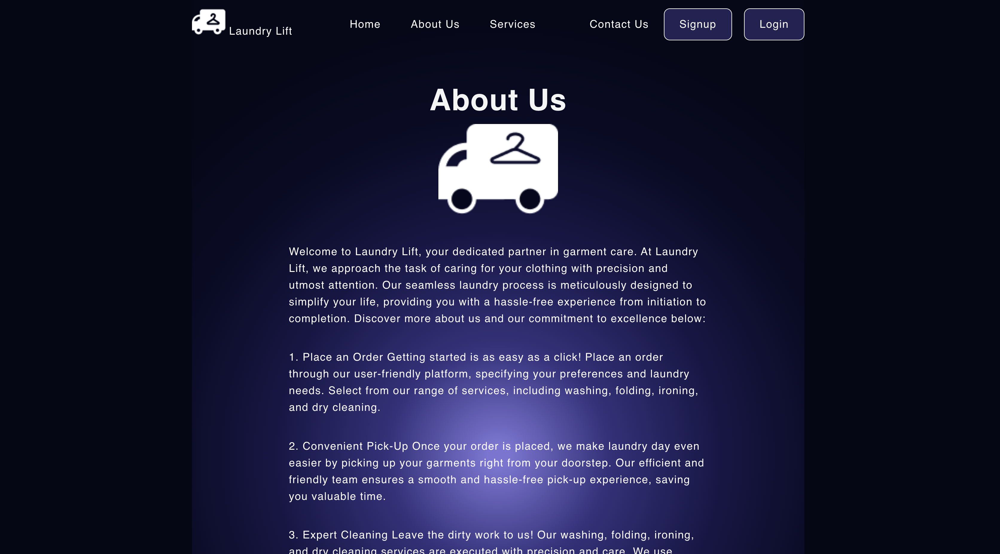
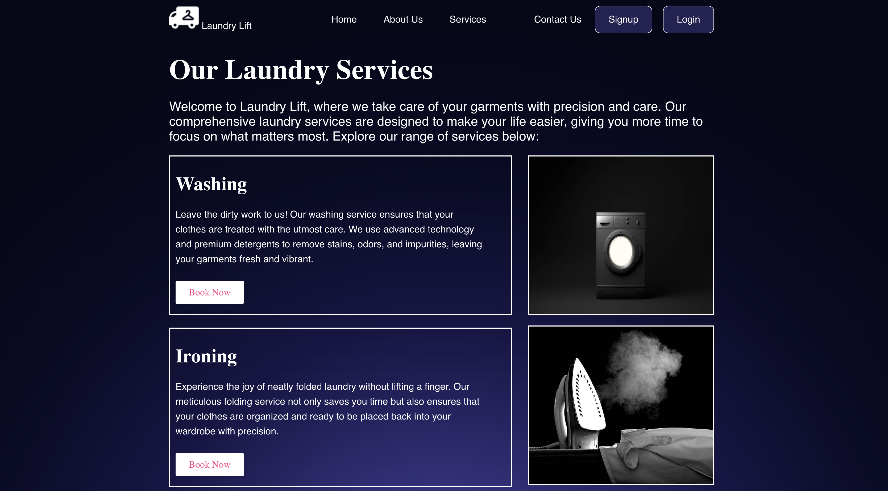
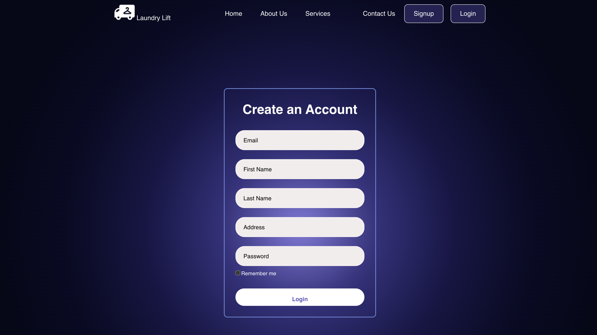

# LaundryLift

Welcome to LaundryLift, a modern MERN stack single-page application designed to simplify laundry management. Developed as the final project for the 23 Bootcamp, LaundryLift showcases a collaborative effort to create a scalable, user-focused solution using real-world data.

## About the App

LaundryLift is your go-to platform for hassle-free laundry management. Place orders effortlessly, enjoy convenient pick-ups, and experience expert cleaning with our range of services, including washing, folding, ironing, and dry cleaning. Our advanced technology, premium detergents, and industry-leading techniques ensure your garments receive top-notch treatment. Sit back and relax as we deliver your freshly cleaned and neatly folded laundry right to your doorstep.

## Concept

At Laundry Lift, we understand the importance of clean, well-maintained clothing. Our services are tailored to meet your specific needs, providing you with the convenience and peace of mind you deserve. Trust us with your laundry, and let us elevate your laundry experience.

## Screenshots

## Contributors

- [Basit Malik & Hector Sanchez](#): Frontend Developer
- [Anthony Adamson](#): Backend Developer
- [Basit Malik](#): UI/UX Designer

## Technologies Used

- **React:** Front-end library for building user interfaces.
- **GraphQL:** Query language for APIs, used in conjunction with a Node.js and Express.js server.
- **MongoDB and Mongoose ODM:** Database and Object Data Modeling for smooth data handling.
- **JWT (JSON Web Tokens):** Ensures secure user authentication.

## CSS Styling

LaundryLift adopts modern CSS-in-JS approaches, utilizing libraries like [styled-components](https://styled-components.com/) and [Emotion](https://emotion.sh/docs/introduction). This provides a declarative and maintainable way to style components, ensuring a professional and mobile-friendly user interface.

## Bonus Features

As a forward-thinking project, LaundryLift aims to implement Progressive Web App (PWA) functionality, enhancing user experience with features like offline functionality and installability.

## Presentation

- **Elevator Pitch:** LaundryLift streamlines laundry management with real-time updates and integrated payments.
- **Concept:** A unique and novel solution addressing the efficiency of laundry management.
- **Process:** Collaborative development using React, GraphQL, MongoDB, and Stripe. Overcoming challenges and celebrating successes.
- **Demo:** A live demonstration showcasing LaundryLift's key features.
- **Directions for Future Development:** A roadmap for further enhancing LaundryLift.

## Get Started

Explore LaundryLift by visiting [Deployed Application](https://laundry-lift2-e6a78dcc7194.herokuapp.com/home) and delve into the code on [GitHub](https://github.com/basitmalik97/LaundryLift).

Enjoy the LaundryLift experience!
